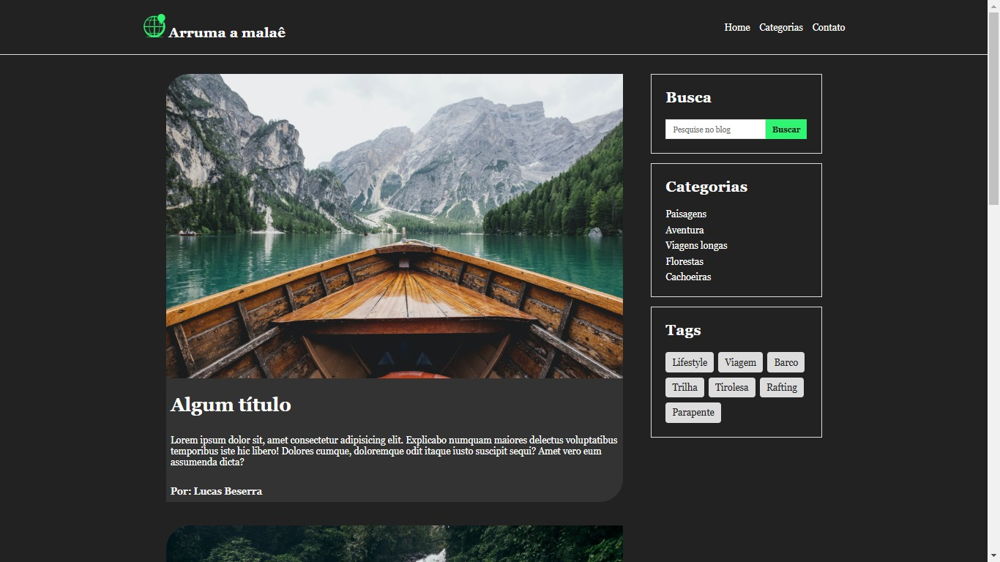

# Blog de viagens à natureza, feito com HTML e CSS.

## Este projeto foi desenvolvido durante o excelente curso do Hora de Codar!

### Fiz este projeto para reforçar os conceitos básicos do HTML e do CSS.

> PrintScreen da tela exibindo o layout da página.
